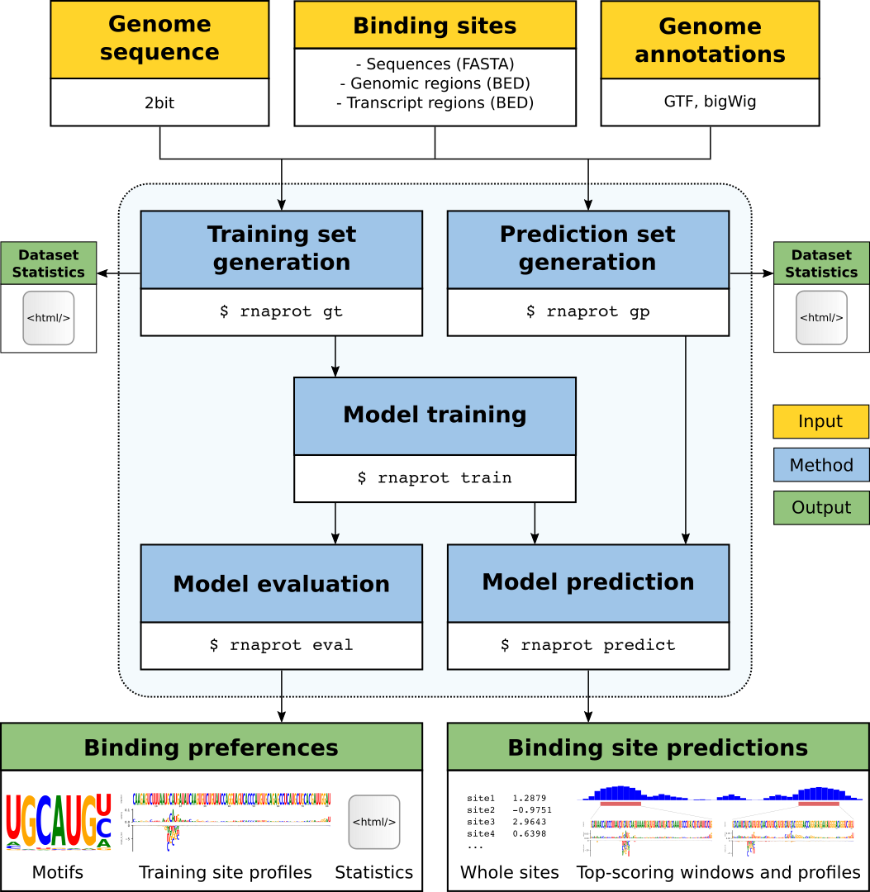

# RNAProt

RNAProt is a computational RBP binding site prediction framework based on recurrent neural networks (RNNs). Conceived as an end-to-end method, RNAProt includes all necessary functionalities, from dataset generation over model training to the evaluation of binding preferences and binding site prediction. Various input types and features are supported, accompanied by comprehensive statistics and visualizations to inform the user about datatset characteristics and learned model properties.


## Table of contents

- [RNAProt framework introduction](#the-rnaprot-framework)
- [RNAProt installation](#installation)
    - [Conda](#conda)
    - [Conda package installation](#conda-package-installation)
    - [Manual installation](#manual-installation)
    - [Nvidia driver and CUDA](#nvidia-driver-and-cuda)
    - [PyTorch and PyTorch geometric](#pytorch-and-pytorch-geometric)
    - [Additional libraries](#additional-libraries)
    - [Tool installation](#tool-installation)
    - [Test run](#test-run)
- [GraphProt2 documentation](#documentation)
    - [Program modes](#program-modes)
    - [Supported features](#supported-features)
    - [Inputs](#inputs)
    - [Outputs](#outputs)


## The RNAProt framework


RNAProt utilizes RBP binding sites identified by CLIP-seq and related protocols to train an RNN-based model. The model is then used to predict new binding sites on given input RNA sequences. The following figure illustrates the RNAProt framework and its general workflow:





Yellow boxes mark necessary framework inputs, blue boxes the five program modes of RNAProt, and green boxes the framework outputs. Arrows show the dependencies between inputs, modes, and outputs. RNAProt accepts RBP binding sites in FASTA or BED format. The latter one also requires a genomic sequence file (.2bit format) and a genomic annotations file (GTF format).


RNAProt requires at least three inputs: a set of RBP binding sites (either in BED or FASTA format), a genomic sequence file (.2bit format), and a genomic annotations file (GTF format). 
Binding sites can be supplied either as sequences, genomic regions, or as transcript regions (GTF file with corresponding transcript annotation required). 
Additional inputs are available, depending on the binding site input type as well as the selected features. For more details on inputs, modes, supported features, and outputs, see the documentation below.


## Installation

RNAProt was tested on Ubuntu (18.04 LTS), with Nvidia driver >=440, CUDA >=10, and various Nvidia graphics cards (RTX 2080 Ti, RTX 2070, GTX 1060, GTX 1030). We thus assume that you have a similar system available and running. While RNAProt runs fine without a dedicated GPU, we definitely recommend having an Nvidia graphics card with CUDA support for speeding up model training (specifically we recommend a >= GTX 1060 or a similar newer model, with >= 4 GB RAM). Regarding main memory, we recommend at least 8 GB RAM.
In the following we show how to install RNAProt via Conda package (easiest way + recommended), or alternatively manually (not too difficult either). In any case, you first need Conda running on your computer.

### Conda

If you do not have Conda yet, you can e.g. install miniconda, a free + lightweight Conda installer. Get miniconda [here](https://docs.conda.io/en/latest/miniconda.html), choose the Python 3.8 Miniconda3 Linux 64-bit installer and follow the installation instructions. In the end, Conda should be evocable on the command line via (possibly in a different version):

```
$ conda --version
conda 4.9.2
```

### Conda package installation

RNAProt is available as Conda package [here](https://anaconda.org/bioconda/rnaprot). This is the most convenient way to install RNAProt, since Conda takes care of all the dependencies. Note however that the Conda package version might not always be the latest release (but we work hard to not let this happen).

We recommend to create a Conda environment inside which we will then install RNAProt:

```
conda create -n rnaprotenv python=3.8 -c conda-forge bioconda
conda activate rnaprotenv
 conda install -c bioconda rnaprot
```

Now RNAProt should be available inside the environment:


```
rnaprot -h
```

Finally, if you have a compatible GPU, we want to check whether the GPU (CUDA and Nvidia CUDA Compiler nvcc) is available for RNAProt:

```
python -c "import torch; print(torch.__version__)"
python -c "import torch; print(torch.cuda.is_available())"
python -c "import torch; print(torch.version.cuda)"
nvcc --version
```

In our test case this delivered:

```
$ python -c "import torch; print(torch.__version__)"
1.7.1
$ python -c "import torch; print(torch.cuda.is_available())"
True
$ python -c "import torch; print(torch.version.cuda)"
10.2
$ nvcc --version
nvcc: NVIDIA (R) Cuda compiler driver
Copyright (c) 2005-2018 NVIDIA Corporation
Built on Sat_Aug_25_21:08:01_CDT_2018
Cuda compilation tools, release 10.0, V10.0.130
```

This is great news, meaning that we can RNAProt with GPU support.


### Manual installation

To manually install RNAProt, we first create a Conda environment (as described in [above](#conda)). Once inside the environment, we need to install the following dependencies:

```
conda install -c conda-forge pytorch=1.7.1=cuda102py38h9f8c3ab_1 cudatoolkit=10.2
conda install -c conda-forge seaborn=0.11.1
conda install -c bioconda viennarna=2.4.17
conda install -c bioconda bedtools=2.29.2
conda install -c bioconda logomaker=0.8
conda install -c conda-forge hpbandster=0.7.4
conda install -c conda-forge markdown=3.2.2
conda install -c conda-forge plotly=4.14.3
conda install -c conda-forge scikit-learn=0.24.1
conda install -c bioconda ushuffle=1.2.2
conda install -c bioconda ucsc-twobitinfo
conda install -c bioconda ucsc-twobittofa
conda install -c bioconda ucsc-bigwigaverageoverbed
```


Finally, to install RNAProt, we simply clone the repository and execute the installation script inside the folder:

```
git clone https://github.com/BackofenLab/RNAProt.git
cd CLIPcontext
python -m pip install . --ignore-installed --no-deps -vv
```

Now we can run rnaprot from any given folder (just remember to re-activate the environment once you open a new shell):

```
rnaprot -h
```

### Test runs

Once installed, we can do some small test runs. 


#### Test example with FASTA sequences as input

We first train a sequence model, using a provided set of positive and negative FASTA sequences sampled from the PARCLIP PUM2 dataset (3,000 positives, 3,000 negatives, all sequences with length 81 nt). In the following we will mainly use default parameters, but note that there are many options available for each program mode. To learn more about the mode options, refer to the [Documentation](#documentation), or simply list all mode options, e.g. for `rnaprot train`, by typing:

```
rnaprot train -h
```

Before training a model, we need to generate an RNAProt training dataset. For this we go to the cloned repository folder, and use the FASTA sequences supplied in the test/ folder as training data. To get training set statistics, we also enable `--report`:


```
rnaprot gt --in test/PUM2_PARCLIP.positives.fa --neg-in test/PUM2_PARCLIP.negatives.fa --out PUM2_PARCLIP_gt_out --report
```

We can then take a look at the `report.rnaprot_gt.html` inside `test_gt_out`, informing us about similarities and differences between the positive and negative set. The content of the HTML report depends on selected features (e.g. structure, conservation scores, region annotations), and the input type given to `rnaprot gt` (FASTA sequences, genomic sites BED, or transcript sites BED). Here for example we can compare k-mer statistics of the positive and negative set, observing that the positives tend to contain more AA, UU, and AU repeat sites. This likely also contributes to the lower sequence complexity shown for the postive set.


Next we train a model on the created dataset, using default parameters. For this we simply run `rnaprot train` with the `rnaprot gt` output folder as input. We also enable `--verbose-train`, to see the learning progress over the number of epochs:

```
rnaprot train --in test_gt_out --out test_train_out --verbose-train
```

In the end we get a summary for the trained model, e.g. reporting the model validation AUC, the training runtime, and set hyperparameters. To visualize what our just-trained model has learned, we next run `rnaprot eval`, which requires both the `rnaprot gt` and `rnaprot train` output folders:

```
rnaprot eval --gt-in test_gt_out --train-in test_train_out --out test_eval_out
```

This will plot a sequence logo informing about global preferences, as well as profiles for the top 25 scoring sites (default setting). The profiles contain the saliency map and single mutations track, giving us an idea what local information the model regards as important for each of the 25 sites. As with the other modes, more options are available (e.g. `--report` for additional statistics, comparing two models, or specifying motif sizes and which profiles to plot).

Now that we have a model, we naturally want to use it for prediction. For this we first create a prediction dataset, choosing the lncRNA NORAD for window prediction. NORAD was shown to act as a [decoy](https://www.sciencedirect.com/science/article/pii/S0092867415016414) for PUMILIO proteins (PUM1/PUM2). We therefore use its FASTA sequence as input:

rnaprot gp --in test/NORAD_lncRNA.fa --train-in test_train_out --out test_gp_out --report

Note that the input can be any number of sequences, genomic regions, or transcript regions.

By default, rnaprot predicts whole sites, i.e., we would get one score returned for the whole lncRNA. To run the window prediction, we use --mode 2, and also plot the top window profiles containing the reported peak regions:

rnaprot predict --in test_gp_out --train-in test_train_out/ --out test_predict_out --mode 2 --plot-top-profiles

Now we can take a look at the predicted peak regions (BED, TSV), or observe the profiles just like for rnaprot eval. The predicted peak regions are stored in BED format, as well as in a table file with additional information (.tsv). For details on output formats, see the Documentation.


We will first train and apply a sequence model using a provided set of FASTA sequences, and in the second example 

 inside the RNAProt folder, with the datasets provided in the `test/` subfolder. First we generate a training dataset and the corresponding HTML report by:


Again with only conda now on i7:

conda create -n rnaprotenv2 python=3.8  -c conda-forge # 32.4 MB
conda activate rnaprotenv2
#conda install -c conda-forge pytorch=1.7.1 cudatoolkit=10.2 # 512.0 MB (incl. numpy 1.19.2 !)

# Do this instead:
conda install -c conda-forge pytorch=1.7.1=cuda102py38h9f8c3ab_1 cudatoolkit=10.2


conda install -c conda-forge seaborn=0.11.1 # 50.3 MB (incl pandas 1.2.3, statsmodels 0.12.2 matplotlib base 3.3.4 (!) ).

#conda install -c conda-forge numpy=1.19.2
#conda install -c conda-forge statsmodels=0.12.2

conda install -c bioconda viennarna=2.4.17
conda install -c bioconda bedtools=2.29.2
conda install -c bioconda logomaker=0.8 # 182.2 MB ! (this also includes matplotlib 3.3.4 )

conda install -c conda-forge hpbandster=0.7.4 # 3.2 MB
conda install -c conda-forge markdown=3.2.2
conda install -c conda-forge plotly=4.14.3  # 5.9 MB
conda install -c bioconda ushuffle=1.1.2  (no 1.1.2), try 1.2.2
conda install -c bioconda ushuffle=1.2.2 # 25 KB


conda install -c bioconda ucsc-twobitinfo # 3.0 MB
conda install -c bioconda ucsc-twobittofa # 442 KB
conda install -c bioconda ucsc-bigwigaverageoverbed # 443 KB

conda install -c conda-forge scikit-learn=0.24.1 # 8.1 MB


Finally, we want to check whether the GPU (CUDA and Nvidia CUDA Compiler nvcc) i


Finally, to check whether pyTorch, CUDA and the GPU is available for computing:


Nvidia CUDA Compiler


```
python -c "import torch; print(torch.__version__)"
python -c "import torch; print(torch.cuda.is_available())"
python -c "import torch; print(torch.version.cuda)"
nvcc --version
```


If you do have a compatible GPU, you ca


Once installed, we create an environment named gp2env and activate it:


If you do not have conda yet, you can e.g. install miniconda, a free + lightweight conda installer. Get miniconda [here](https://docs.conda.io/en/latest/miniconda.html), choose the Python 3.8 Miniconda3 Linux 64-bit installer and follow the installation instructions. In the end, conda should be evocable via (possibly in a different version):

```
$ conda --version
conda 4.9.2
```


### Manual installation


To install CLIPcontext, simply clone the repository and use the Python script within the folder:

```
git clone https://github.com/BackofenLab/CLIPcontext.git
cd CLIPcontext
python -m pip install . --ignore-installed --no-deps -vv
```

CLIPcontext can also be installed via [conda](https://anaconda.org/bioconda/clipcontext). This is the most convenient way to install CLIPcontext, since conda takes care of all the dependencies. Note however that the conda version might not always be the latest release.


CLIPcontext can also be installed via conda. This is the most convenient way to install CLIPcontext, since conda takes care of all the dependencies. Note however that the conda version might not always be the latest release.


### Nvidia driver and CUDA

GraphProt2 was tested with Nvidia driver 440, which is compatible with CUDA 10.0. We expect later driver versions to be compatible as well. You can check your current driver version with `nvidia-smi`. To install the driver:

```
sudo apt install nvidia-driver-440
```


To install the CUDA toolkit, go [here](https://developer.nvidia.com/cuda-downloads) and download the CUDA Toolkit 10.0 (Sept 2018), which can be found under Legacy releases or directly [here](https://developer.nvidia.com/cuda-10.0-download-archive). Select Linux, x86_64 + your Linux distribution (in our case Ubuntu version 18.04, deb (local)). Follow the shown installation instructions. In our case, these are:

```
sudo dpkg -i cuda-repo-ubuntu1804-10-0-local-10.0.130-410.48_1.0-1_amd64.deb
sudo apt-key add /var/cuda-repo-<version>/7fa2af80.pub
sudo apt-get update
sudo apt-get install cuda
```

Replace `<version>` with the folder name found in the `/var/` folder.

After installation, add the following information to .bashrc (obtained from [here](https://pytorch-geometric.readthedocs.io/en/latest/notes/installation.html)):


```
# CUDA setup paths.
export PATH=/usr/local/cuda/bin:$PATH
export CPATH=/usr/local/cuda/include:$CPATH
export LD_LIBRARY_PATH=/usr/local/cuda/lib64:$LD_LIBRARY_PATH
export DYLD_LIBRARY_PATH=/usr/local/cuda/lib:$DYLD_LIBRARY_PATH
```

Check the version of the CUDA compiler driver with `nvcc`:

```
$ nvcc --version
nvcc: NVIDIA (R) Cuda compiler driver
Copyright (c) 2005-2018 NVIDIA Corporation
Built on Sat_Aug_25_21:08:01_CDT_2018
Cuda compilation tools, release 10.0, V10.0.130
```


### Conda

To install GraphProt2, we first create a conda environment, and then install all the necessary libraries inside. If you do not have conda yet, you can e.g. install miniconda, a free + lightweight conda installer. Get miniconda [here](https://docs.conda.io/en/latest/miniconda.html), choose the Python 3.7 Miniconda3 Linux 64-bit installer and follow the installation instructions. In the end, conda should be evocable via:

```
$ conda --version
conda 4.8.3
```

Once installed, we create an environment named gp2env and activate it:

```
conda create -n gp2env python=3.7
conda activate gp2env
```


### PyTorch and PyTorch geometric

Inside the gp2env environment, we now install PyTorch, PyTorch geometric, and all remaining necessary libraries. 
The instructions are based on the description found [here](https://pytorch-geometric.readthedocs.io/en/latest/notes/installation.html).
To install PyTorch + PyTorch geometric, execute:

```
conda install pytorch=1.2.0=py3.7_cuda10.0.130_cudnn7.6.2_0 torchvision=0.4.0=py37_cu100 cudatoolkit=10.0 -c pytorch
pip install torch-scatter==1.3.1 -f https://pytorch-geometric.com/whl/torch-1.5.0.html
pip install torch-sparse==0.4.0 -f https://pytorch-geometric.com/whl/torch-1.5.0.html
pip install torch-cluster==1.4.4 -f https://pytorch-geometric.com/whl/torch-1.5.0.html
pip install torch-spline-conv==1.1.0 -f https://pytorch-geometric.com/whl/torch-1.5.0.html
pip install torch-geometric==1.3.1
```

Note that we explicitely demand the version numbers with which GraphProt2 was tested, to avoid weird error messages and incompatibile code. Newer releases have not been tested yet, and thus might not work at this point.

We can check whether the installation was successful with:

```
python -c "import torch; print(torch.__version__)"
python -c "import torch; print(torch.cuda.is_available())"
python -c "import torch; print(torch.version.cuda)"
nvcc --version
```

In our case, we get the following outputs:

```
$ python -c "import torch; print(torch.__version__)"
1.2.0
$ python -c "import torch; print(torch.cuda.is_available())"
True
$ python -c "import torch; print(torch.version.cuda)"
10.0.130
$ nvcc --version
nvcc: NVIDIA (R) Cuda compiler driver
Copyright (c) 2005-2018 NVIDIA Corporation
Built on Sat_Aug_25_21:08:01_CDT_2018
Cuda compilation tools, release 10.0, V10.0.130
```

When you run GraphProt2 (after installing additional libraries), and get an error like "`ModuleNotFoundError: No module named ..`", try to reinstall PyTorch geometric with `--no-cache-dir` enabled:

```
pip uninstall torch-scatter
pip install --no-cache-dir torch-scatter==1.3.1 -f https://pytorch-geometric.com/whl/torch-1.5.0.html
pip uninstall torch-sparse
pip install --no-cache-dir torch-sparse==0.4.0 -f https://pytorch-geometric.com/whl/torch-1.5.0.html
pip uninstall torch-cluster
pip install --no-cache-dir torch-cluster==1.4.4 -f https://pytorch-geometric.com/whl/torch-1.5.0.html
```


### Additional libraries

Last but not least, we need some additional libraries:

```
conda install seaborn==0.10.1
conda install -c bioconda viennarna=2.4.14
pip install markdown==3.2.2
pip install logomaker==0.8
pip install ushuffle
```

Installing seaborn should also install matplotlib (tested with 3.1.3) + pandas (tested with 1.0.4). To check which packages and versions of them are installed inside the enviromnent, type `conda list`.


In addition to the Python libaries, we also need some command line tools to be available in PATH. If you need these tools often, you might want to install them globally (executables in PATH):

- [bedtools](https://github.com/arq5x/bedtools2/releases)  (tested with version 2.29.0)
- [twoBitToFa](http://hgdownload.cse.ucsc.edu/admin/exe/linux.x86_64/twoBitToFa)
- [twoBitInfo](http://hgdownload.cse.ucsc.edu/admin/exe/linux.x86_64/twoBitInfo)
- [bigWigAverageOverBed](http://hgdownload.cse.ucsc.edu/admin/exe/linux.x86_64/bigWigAverageOverBed) (to extract conservation scores)


However, installation inside the environment is also possible:


```
conda install -c bioconda bedtools
conda install -c bioconda ucsc-twobitinfo
conda install -c bioconda ucsc-twobittofa
conda install -c bioconda ucsc-bigwigaverageoverbed
```


### Tool installation

To install the GraphProt2 library and executable inside the conda environment:

```
git clone https://github.com/BackofenLab/GraphProt2.git
cd GraphProt2
python -m pip install . --ignore-installed --no-deps -vv

```

### Test runs

Once installed, we can do some small test runs inside the GraphProt2 folder, with the datasets provided in the `test/` subfolder. First we generate a training dataset and the corresponding HTML report by:

```
graphprot2 gt --in test/positives.fa --neg-in test/negatives.fa --out test_gt_out --report
```

Then we train a model on this dataset with:

```
graphprot2 train --in test_gt_out --out test_train_out
```

We can then plot motifs and profiles by:

```
graphprot2 eval --in test_train_out --out test_eval_out
```

To do whole site predictions with the created model, we first generate a prediction dataset:

```
graphprot2 gp --in test/test_ws.fa --out test_gp_ws_out
```

We then predict whole sites (`--mode 1`) by:

```
graphprot2 predict --in test_gp_ws_out --model-in test_train_out --out test_predict_ws_out --mode 1
```

To do profile predictions with the created model, we first generate a prediction dataset:

```
graphprot2 gp --in test/test_profile.fa --out test_gp_profile_out
```

We then predict profiles (`--mode 2`) by:

```
graphprot2 predict --in test_gp_profile_out --model-in test_train_out --out test_predict_profile_out --mode 2
```


## Documentation


This documentation provides details on all the GraphProt2 framework parts: program modes, supported features, inputs, and outputs.


### Program modes

GraphProt2 is divided into five different program modes: training set generation, prediction set generation, model training, model evaluation, and model prediction.


An overview of the modes can be obtained by:


```
$ graphprot2
usage: graphprot2 [-h] [-v] {train,eval,predict,gt,gp} ...

Modelling RBP binding preferences to predict RPB binding sites.

positional arguments:
  {train,eval,predict,gt,gp}
                        Program modes
    train               Train a binding site prediction model
    eval                Evaluate properties learned from positive sites
    predict             Predict binding sites (whole sites or profiles)
    gt                  Generate training data set
    gp                  Generate prediction data set

optional arguments:
  -h, --help            show this help message and exit
  -v, --version         show program's version number and exit

```

The following sections describe each mode in more detail.


#### Training set generation

The following command line arguments are available in `graphprot2 gt` mode:

```
graphprot2 gt -h
usage: graphprot2 gt [-h] --in str --out str [--gtf str] [--gen str]
                     [--mode {1,2,3}] [--mask-bed str] [--seq-ext int]
                     [--con-ext int] [--thr float] [--rev-filter]
                     [--max-len int] [--min-len int] [--keep-ids]
                     [--allow-overlaps] [--no-gene-filter] [--con-ext-pre]
                     [--neg-comp-thr float] [--neg-factor {2,3,4,5}]
                     [--keep-add-neg] [--neg-in str] [--shuffle-k {1,2,3}]
                     [--report] [--theme {1,2}] [--eia] [--eia-ib] [--eia-n]
                     [--tr-list str] [--phastcons str] [--phylop str] [--tra]
                     [--tra-codons] [--tra-borders] [--rra] [--str] [--bp-in]
                     [--plfold-u int] [--plfold-l int] [--plfold-w int]

optional arguments:
  -h, --help            show this help message and exit
  --gtf str             Genomic annotations GTF file (.gtf or .gtf.gz)
  --gen str             Genomic sequences .2bit file
  --mode {1,2,3}        Define mode for --in BED site extraction. (1) Take the
                        center of each site, (2) Take the complete site, (3)
                        Take the upstream end for each site. Note that --min-
                        len applies only for --mode 2 (default: 1)
  --mask-bed str        Additional BED regions file (6-column format) for
                        masking negatives (e.g. all positive RBP CLIP sites)
  --seq-ext int         Up- and downstream sequence extension of sites (site
                        definition by --mode) with uppercase characters
                        (default: 30)
  --con-ext int         Up- and downstream context sequence extension of sites
                        (site definition by --mode) with lowercase characters.
                        Note that statistics (--report) are produced only for
                        uppercase sequence parts (defined by --seq-ext)
                        (default: False)
  --thr float           Minimum site score (--in BED column 5) for filtering
                        (assuming higher score == better site) (default: None)
  --rev-filter          Reverse --thr filtering (i.e. the lower the better,
                        e.g. for p-values) (default: False)
  --max-len int         Maximum length of --in sites (default: 300)
  --min-len int         Minimum length of --in sites (only effective for
                        --mode 2). If length < --min-len, take center and
                        extend to --min-len. Use uneven numbers for equal up-
                        and downstream extension (default: 21)
  --keep-ids            Keep --in BED column 4 site IDs. Note that site IDs
                        have to be unique (default: False)
  --allow-overlaps      Do not select for highest-scoring sites in case of
                        overlapping sites (default: False)
  --no-gene-filter      Do not filter positives based on gene coverage (gene
                        annotations from --gtf) (default: False)
  --con-ext-pre         Add --con-ext extension before selecting for highest-
                        scoring sites in case of overlaps (not afterwards)
                        (default: False)
  --neg-comp-thr float  Sequence complexity (Shannon entropy) threshold for
                        filtering random negative regions (default: 0.5)
  --neg-factor {2,3,4,5}
                        Determines number of initial random negatives to be
                        extracted (== --neg-factor n times # positives)
                        (default: 2)
  --keep-add-neg        Keep additional negatives (# controlled by --neg-
                        factor) instead of outputting same numbers of positive
                        and negative sites (default: False)
  --neg-in str          Negative genomic or transcript sites in BED (6-column
                        format) or FASTA format (unique IDs required). Use
                        with --in BED/FASTA. If not set, negatives are
                        generated by shuffling --in sequences (if --in FASTA)
                        or random selection of genomic or transcript sites (if
                        --in BED)
  --shuffle-k {1,2,3}   Supply k for k-nucleotide shuffling of --in sequences
                        to generate negative sequences (if no --neg-fa
                        supplied) (default: 2)
  --report              Output an .html report providing various training set
                        statistics and plots (default: False)
  --theme {1,2}         Set theme for .html report (1: default, 2: midnight
                        blue) (default: 1)

required arguments:
  --in str              Genomic or transcript RBP binding sites file in BED
                        (6-column format) or FASTA format. If --in FASTA, only
                        --str is supported as additional feature. If --in BED,
                        --gtf and --gen become mandatory
  --out str             Output training data folder (== input folder to
                        graphprot2 train)

additional annotation arguments:
  --eia                 Add exon-intron annotations to genomic regions
                        (default: False)
  --eia-ib              Add intron border annotations to genomic regions (in
                        combination with --exon-intron) (default: False)
  --eia-n               Label regions not covered by intron or exon regions as
                        N instead of labelling them as introns (I) (in
                        combination with --exon-intron) (default: False)
  --tr-list str         Supply file with transcript IDs (one ID per row) for
                        exon intron labeling (using the corresponding exon
                        regions from --gtf). By default, exon regions of the
                        most prominent transcripts (automatically selected
                        from --gtf) are used (default: False)
  --phastcons str       Genomic .bigWig file with phastCons conservation
                        scores to add as annotations
  --phylop str          Genomic .bigWig file with phyloP conservation scores
                        to add as annotations
  --tra                 Add transcript region annotations (5'UTR, CDS, 3'UTR,
                        None) to genomic and transcript regions (default:
                        False)
  --tra-codons          Add start and stop codon annotations to genomic or
                        transcript regions (in combination with --tra)
                        (default: False)
  --tra-borders         Add transcript and exon border annotations to
                        transcript regions (in combination with --tra)
                        (default: False)
  --rra                 Add repeat region annotations for genomic or
                        transcript regions retrieved from --gen .2bit
                        (default: False)
  --str                 Add base pairs and position-wise structural elements
                        probabilities features (calculate with RNAplfold)
                        (default: False)
  --bp-in               Supply a custom base pair annotation file for all --in
                        sites. This disables base pair calculation for the
                        positive set (default: False)
  --plfold-u int        RNAplfold -u parameter value (default: 3)
  --plfold-l int        RNAplfold -L parameter value (default: 100)
  --plfold-w int        RNAplfold -W parameter value (default: 150)

```

#### Prediction set generation

The following command line arguments are available in `graphprot2 gp` mode:

```
graphprot2 gp -h
usage: graphprot2 gp [-h] --in str --out str [--gtf str] [--gen str]
                     [--keep-ids] [--gene-filter] [--con-ext int] [--report]
                     [--theme {1,2}] [--eia] [--eia-ib] [--eia-n]
                     [--tr-list str] [--phastcons str] [--phylop str] [--tra]
                     [--tra-codons] [--tra-borders] [--rra] [--str]
                     [--bp-in str] [--plfold-u int] [--plfold-l int]
                     [--plfold-w int]

optional arguments:
  -h, --help       show this help message and exit
  --gtf str        Genomic annotations GTF file (.gtf or .gtf.gz)
  --gen str        Genomic sequences .2bit file
  --keep-ids       Keep --in BED column 4 site IDs. Note that site IDs have to
                   be unique (default: False)
  --gene-filter    Filter --in sites based on gene coverage (gene annotations
                   from --gtf) (default: False)
  --con-ext int    Up- and downstream context sequence extension of --in sites
                   with lowercase characters for whole site prediction
                   (graphprot predict --mode 1). Best use same --con-ext
                   values in gp+gt+train modes. Note that statistics
                   (--report) are produced only for uppercase sequence parts
                   (default: False)
  --report         Output an .html report providing various training set
                   statistics and plots (default: False)
  --theme {1,2}    Set theme for .html report (1: default, 2: midnight blue)
                   (default: 1)

required arguments:
  --in str         Genomic or transcript RBP binding sites file in BED
                   (6-column format) or FASTA format. If --in FASTA, only
                   --str is supported as additional feature. If --in BED,
                   --gtf and --gen become mandatory
  --out str        Output prediction dataset folder (== input folder to
                   graphprot2 predict)

additional annotation arguments:
  --eia            Add exon-intron annotations to genomic regions (default:
                   False)
  --eia-ib         Add intron border annotations to genomic regions (in
                   combination with --exon-intron) (default: False)
  --eia-n          Label regions not covered by intron or exon regions as N
                   instead of labelling them as introns (I) (in combination
                   with --exon-intron) (default: False)
  --tr-list str    Supply file with transcript IDs (one ID per row) for exon
                   intron labeling (using the corresponding exon regions from
                   --gtf). By default, exon regions of the most prominent
                   transcripts (automatically selected from --gtf) are used
                   (default: False)
  --phastcons str  Genomic .bigWig file with phastCons conservation scores to
                   add as annotations
  --phylop str     Genomic .bigWig file with phyloP conservation scores to add
                   as annotations
  --tra            Add transcript region annotations (5'UTR, CDS, 3'UTR, None)
                   to genomic and transcript regions (default: False)
  --tra-codons     Add start and stop codon annotations to genomic or
                   transcript regions (in combination with --tra) (default:
                   False)
  --tra-borders    Add transcript and exon border annotations to transcript
                   regions (in combination with --tra) (default: False)
  --rra            Add repeat region annotations for genomic or transcript
                   regions retrieved from --gen .2bit (default: False)
  --str            Add base pairs and position-wise structural elements
                   probabilities features (calculate with RNAplfold) (default:
                   False)
  --bp-in str      Supply a custom base pair annotation file for all --in
                   sites, disabling base pair calculation with RNAplfold
                   (default: False)
  --plfold-u int   RNAplfold -u parameter value (default: 3)
  --plfold-l int   RNAplfold -L parameter value (default: 100)
  --plfold-w int   RNAplfold -W parameter value (default: 150)

```

#### Model training

The following command line arguments are available in `graphprot2 train` mode:

```
graphprot2 train -h
usage: graphprot2 train [-h] --in IN_FOLDER --out OUT_FOLDER [--only-seq]
                        [--use-phastcons] [--use-phylop] [--use-eia]
                        [--use-tra] [--use-rra] [--use-str-elem-p] [--use-bps]
                        [--bps-mode {1,2}] [--bps-prob-cutoff float]
                        [--uc-context] [--gen-cv] [--gen-cv-k {5,10}]
                        [--gm-cv] [--train-cv] [--train-cv-k {5,10}]
                        [--train-vs float] [--batch-size int [int ...]]
                        [--epochs int] [--patience int] [--fc-hidden-dim int]
                        [--list-lr float [float ...]]
                        [--list-hidden-dim int [int ...]]
                        [--list-weight-decay float [float ...]]

optional arguments:
  -h, --help            show this help message and exit

required arguments:
  --in IN_FOLDER        Input training data folder (output of graphprot2 gt)
  --out OUT_FOLDER      Model training results output folder

feature definition arguments:
  --only-seq            Use only sequence feature. By default all features
                        present in --in are used as node attributes (default:
                        False)
  --use-phastcons       Add phastCons conservation scores. Set --use-x to
                        define which features to add on top of sequence
                        feature (by default all --in features are used)
  --use-phylop          Add phyloP conservation scores. Set --use-x to define
                        which features to add on top of sequence feature (by
                        default all --in features are used)
  --use-eia             Add exon-intron annotations. Set --use-x to define
                        which features to add on top of sequence feature (by
                        default all --in features are used)
  --use-tra             Add transcript region annotations. Set --use-x to
                        define which features to add on top of sequence
                        feature (by default all --in features are used)
  --use-rra             Add repeat region annotations. Set --use-x to define
                        which features to add on top of sequence feature (by
                        default all --in features are used)
  --use-str-elem-p      Add structural elements probabilities. Set --use-x to
                        define which features to add on top of sequence
                        feature (by default all --in features are used)
  --use-bps             Add base pairs to graph. Set --use-x to define which
                        features to add on top of sequence feature (by default
                        all --in features are used)
  --bps-mode {1,2}      Defines which base pairs are added to the graphs.
                        --bpp-mode 1 : base pairs with start or end in
                        viewpoint region. --bpp-mode 2 : only base pairs with
                        start+end in viewpoint (default: 1)
  --bps-prob-cutoff float
                        Base pair probability cutoff for filtering base pairs
                        added to the graph (default: 0.5)
  --uc-context          Convert lowercase context (if present, added by
                        graphprot2 gt --con-ext) to uppercase (default: False)

model definition arguments:
  --gen-cv              Run cross validation in combination with
                        hyperparameter optimization to evaluate generalization
                        performance (default: False)
  --gen-cv-k {5,10}     Cross validation k for evaluating generalization
                        performance (default: 10)
  --gm-cv               Treat data as generic model data (positive IDs with
                        specific format required). This turns on generic model
                        data cross validation, with every fold leaving one RBP
                        set out for testing (ignoring --gen-cv and --gen-cv-k)
                        (default: False)
  --train-cv            Run cross validation to train final model, with
                        hyperparameter optimization in each split and
                        selection of best parameters based their on average
                        performance on validation sets. By default final model
                        training is done for one split only (validation set
                        size controlled by --train-vs). Note that --train-cv
                        with many hyperparameter combinations considerably
                        increases run time (default: False)
  --train-cv-k {5,10}   Final model cross validation k. Use in combination
                        with --train-cv (default: 5)
  --train-vs float      Validation set size for training final model as
                        percentage of all training sites. Only effective if
                        --train-cv not set (with --train-cv validation set
                        size controlled by --train-cv-k) (default: 0.2)
  --batch-size int [int ...]
                        List of gradient descent batch sizes (default: 50)
  --epochs int          Number of training epochs (default: 200)
  --patience int        Number of epochs to wait for further improvement on
                        validation set before stopping (default: 30)
  --fc-hidden-dim int   Number of dimensions for fully connected layers
                        (default: 128)
  --list-lr float [float ...]
                        List of learning rates for hyperparameter optimization
                        (default: 0.0001)
  --list-hidden-dim int [int ...]
                        List of node feature dimensions in hidden layers for
                        hyperparameter optimization (default: 128)
  --list-weight-decay float [float ...]
                        List of weight decays for hyperparameter optimization
                        (default: 0.0001)

```

#### Model evaluation

The following command line arguments are available in `graphprot2 eval` mode:

```
graphprot2 eval -h
usage: graphprot2 eval [-h] --in IN_FOLDER --out OUT_FOLDER
                       [--nr-top-sites LIST_NR_TOP_SITES [LIST_NR_TOP_SITES ...]]
                       [--nr-top-profiles int]
                       [--motif-size LIST_MOTIF_SIZES [LIST_MOTIF_SIZES ...]]
                       [--motif-sc-thr float]
                       [--win-size LIST_WIN_SIZES [LIST_WIN_SIZES ...]]
                       [--plot-format {1,2}]

optional arguments:
  -h, --help            show this help message and exit
  --nr-top-sites LIST_NR_TOP_SITES [LIST_NR_TOP_SITES ...]
                        Specify number(s) of top predicted sites used for
                        motif extraction. Provide multiple numbers (e.g. --nr-
                        top-sites 100 500 1000) to extract one motif plot from
                        each site set (default: 500)
  --nr-top-profiles int
                        Specify number of top predicted sites to plot profiles
                        for (default: 25)
  --motif-size LIST_MOTIF_SIZES [LIST_MOTIF_SIZES ...]
                        Motif size(s) (widths) for extracting and plotting
                        motifs. Provide multiple sizes (e.g. --motif-size 5 7
                        9) to extract a motif for each size (default: 7)
  --motif-sc-thr float  Minimum profile score of position to be included in
                        motif (default: 0.3)
  --win-size LIST_WIN_SIZES [LIST_WIN_SIZES ...]
                        Windows size(s) for calculating position-wise scoring
                        profiles. Provide multiple sizes (e.g. --win-size 5 7
                        9) to compute average profiles (default: 7)
  --plot-format {1,2}   Plotting format. 1: png, 2: pdf (default: 1)

required arguments:
  --in IN_FOLDER        Input model training folder (output of graphprot2
                        train)
  --out OUT_FOLDER      Evaluation results output folder

```

#### Model prediction

The following command line arguments are available in `graphprot2 predict` mode:

```
graphprot2 predict -h
usage: graphprot2 predict [-h] --in IN_FOLDER --model-in MODEL_IN_FOLDER --out
                          str [--mode {1,2}]
                          [--win-size LIST_WIN_SIZES [LIST_WIN_SIZES ...]]
                          [--peak-ext int] [--con-ext int] [--thr float]
                          [--max-merge-dist int]

optional arguments:
  -h, --help            show this help message and exit
  --mode {1,2}          Define prediction mode. (1) predict whole sites, (2)
                        predict position-wise scoring profiles and extract
                        top-scoring sites from profiles (default: 1)
  --win-size LIST_WIN_SIZES [LIST_WIN_SIZES ...]
                        Windows size(s) for calculating position-wise scoring
                        profiles. Provide multiple sizes (e.g. --win-size 5 7
                        9) to compute average profiles (default: 11)
  --peak-ext int        Up- and downstream peak position extension for
                        extracting top-scoring sites from fixed-window
                        profiles (default: 30)
  --con-ext int         Up- and downstream context extension for extracting
                        top-scoring sites from fixed-window profiles. By
                        default uses --con-ext info from --model-in (if set in
                        graphprot2 train), but restricts it to a maximum of 50
                        (default: False)
  --thr float           Minimum profile position score for extracting peak
                        regions and top-scoring sites. Further increase e.g.
                        in case of too many or too broad peaks (default: 0.5)
  --max-merge-dist int  Maximum distance between two peaks for merging. Two
                        peakse get merged to one if they are <= --max-merge-
                        dist away from each other (default: 0)

required arguments:
  --in IN_FOLDER        Input prediction data folder (output of graphprot2 gp)
  --model-in MODEL_IN_FOLDER
                        Input model training folder containing model file and
                        parameters (output of graphprot2 train)
  --out str             Prediction results output folder

```

### Supported features

GraphProt2 currently supports the following position-wise features which can be utilized for training and prediction in addition to the sequence feature: secondary structure information (base pairs and structural element probabilities), conservation scores (phastCons and phyloP), exon-intron annotation, transcript region annotation, and repeat region annotation. The following table lists the features available for each of the three input types (sequences, genomic regions, transcript regions):


|   Feature       | Sequences | Genomic regions | Transcript regions |
| :--------------: | :--------------: | :--------------: | :--------------: |
| **structure**    | YES | YES | YES |
| **conservation scores**    | NO | YES | YES |
| **exon-intron annotation**    | NO | YES | NO |
| **transcript region annotation**    | NO | YES | YES |
| **repeat region annotation**    | NO | YES | YES |


#### Secondary structure information

GraphProt2 can include two kinds of structure information for a given RNA sequence: 1) base pairs and 2) unpaired probabilities for different loop contexts (probabilities for the nucleotide being paired or inside external, hairpin, internal or multi loops). Both are calculated using the ViennaRNA Python 3 API (ViennaRNA 2.4.14) and RNAplfold with its sliding window approach, with user-definable parameters (by default these are window size = 150, maximum base pair span length = 100, and probabilities for regions of length u = 3). The base pairs with a probability \>= a set threshold (default = 0.5) are then added to the sequence graph as edges between the nodes that represent the end points of the base pair, and the unpaired probability values are added to the node feature vectors. Alternatively, the user can also provide custom base pair information (`--bp-in` option, for `graphprot2 gt` and `graphprot2 gp`), e.g. derived from experimental data. For more details see mode options `--str`, `--use-bps`, `--use-str-elem-p`, `--bps-mode`, and `--bps-prob-cutoff`.


#### Conservation scores

GraphProt2 supports two scores measuring evolutionary conservation (phastCons and phyloP). For the paper, conservation scores were downloaded from the UCSC website, using the phastCons and phyloP scores generated from multiple sequence alignments of 99 vertebrate genomes to the human genome (hg38, [phastCons100way](http://hgdownload.cse.ucsc.edu/goldenpath/hg38/phastCons100way/hg38.phastCons100way.bw) and [phyloP100way](http://hgdownload.cse.ucsc.edu/goldenpath/hg38/phyloP100way/hg38.phyloP100way.bw) datasets). GraphProt2 accepts scores in bigWig (.bw) format (modes `graphprot2 gt` and `graphprot2 gp`, options `--phastcons` and `--phylop`). To assign conservation scores to transcript regions, transcript regions are first mapped to the genome, using the provided GTF file.


#### Exon-intron annotation

Exon-intron annotation in the form of one-hot encoded exon and intron labels can also be added to the node feature vectors.
Labels are assigned to each binding site position by taking a set of genomic exon regions and overlapping it with the genomic binding sites using bedtools (v. 2.29.0). To unambiguously assign labels, GraphProt2 by default uses the most prominent isoform for each gene. The most prominent isoform for each gene gets selected through hierarchical filtering of the transcript information present in the input GTF file (tested with GTF files from [Ensembl](http://www.ensembl.org/info/data/ftp/index.html)): given that the transcript is part of the GENCODE basic gene set, GraphProt2 selects transcripts based on their transcript support level (highest priority), and by transcript length (longer isoform preferred). The extracted isoform exons are then used for region type assignment.
Note that this feature is only available for genomic regions, as it is not informative for transcript regions, which would contain only exon labels. Optionally, a user-defined isoform list can be supplied (`--tr-list`), substituting the list of most prominent isoforms for annotation. Regions not overlapping with introns or exons can also be labelled separately (instead of labelled as intron). For more details see mode options `--eia`, `--eia-ib`, and `--eia-n`.


#### Transcript region annotation

Similarly to the exon-intron annotation, binding regions can be labelled based on their overlap with transcript regions. Labels are assigned based on UTR or CDS region overlap (5'UTR, CDS, 3'UTR, None), by taking the isoform information in the input GTF file. Again the list of most prominent isoforms is used for annotation, or alternatively a list of user-defined isoforms (`--tr-list`). Additional annotation options include start and stop codon or transcript and exon border labelling. For more details see mode options `--tra`, `--tra-codons`, and `--tra-borders`.


#### Repeat region annotation

Repeat region annotation (`--rra` option) can also be added to the binding regions, analogously to other region type annotations. This information is derived directly from the 2bit formatted genomic sequence file, where repeat regions identified by RepeatMasker and Tandem Repeats Finder are stored in lowercase letters. 


### Inputs

GraphProt2 requires at least three inputs: a set of RBP binding sites (BED or FASTA format), a genomic sequence file (.2bit format), and a genomic annotations file (GTF format). Additional input files include BED files (negative sites or regions for masking), conservation scores in bigWig format, transcript lists, or custom base pair information.


#### Binding sites

RBP binding sites can be input in three different formats:

- Sequences (FASTA format)
- Genomic regions (6-column BED format)
- Transcript regions (6-column BED format)

The file content should thus look like:

```
$ head -4 sequences.fa
>seq_1
UUCUCACAUUGGCAUAGACAAGAUUGCAUUCACAGGGUCUACUGAGGUUGGAAAGCUUAUC
>seq_2
GGAUCAAAAGAUACAACAGUUAUCAUAUGGCAAGUUGAUCCGGAUACACACCUGCUAAAAC

$ head -4 genomic_sites.bed
chr7	5593730	5593791	gen_site_1	1.24262727654043	+
chr7	138460417	138460478	gen_site_2	1.24262727654043	+
chr7	73477388	73477449	gen_site_3	4.68741211921332	-
chr7	73442440	73442501	gen_site_4	3.65766477581927	-

$ head -4 transcript_sites.bed
ENST00000360876	1387	1448	tr_site_1	2.99156551237271	+
ENST00000325888	3965	4026	tr_site_2	4.51564577094684	+
ENST00000360876	1320	1381	tr_site_3	3.67261511728524	+
ENST00000325888	3092	3153	tr_site_4	3.05759538270791	+

```

Note that GraphProt2 by default creates unique site IDs. Optionally, the original sequence or site IDs (BED column 4) can be kept (`--keep-ids` in `graphprot2 gt` and `graphprot2 gp`). Also note that BED column 5 contains the site score, which can be used for filtering (`--thr`). In case of p-values, reverse filtering can be enabled with `--rev-filter` (smaller value == better). Filtering by site length is also possible (`--max-len`, `--min-len`), as well as various region filters (`--no-gene-filter`, `--allow-overlaps`, see modes section for more details).

BED files with genomic RBP binding regions can for example be downloaded from [ENCODE](https://www.encodeproject.org/) (eCLIP CLIPper peak regions).


#### Genome sequence

The human genome .2bit formatedd genomic sequence file can be downloaded [here](https://hgdownload.cse.ucsc.edu/goldenpath/hg38/bigZips/hg38.2bit). This file is used to extract genomic and transcript region sequences, as well as repeat region annotations.


#### Genome annotations

GraphProt2 was tested with GTF files obtained from Enseml. See Ensembl's [download page](http://www.ensembl.org/info/data/ftp/index.html) to download the latest GTF file with genomic annotations. Note that GraphProt2 can directly read from gzipped GTF. The GTF file is used to extract exon-intron and transcript region annotations.


#### Additional inputs

Additional input files currently are (depending on set mode):

- BED files (negative sites or regions for masking, 6-column BED format as described)
- A transcript ID list file for exon-intron or transcript region annotation
- Conservation scores in bigWig format
- Custom base pair information file

The transcript IDs list file (`--tr-list` option, for `graphprot2 gt` and `graphprot2 gp`) has the following format (one ID per row):

```
$ head -5 tr_list.in
ENST00000360876
ENST00000325888
ENST00000360876
ENST00000325888
ENST00000359863
```

Files containing phastCons and phyloP conservation scores can be downloaded from UCSC (for hg38 e.g. [phastCons100way](http://hgdownload.cse.ucsc.edu/goldenpath/hg38/phastCons100way/hg38.phastCons100way.bw) and [phyloP100way](http://hgdownload.cse.ucsc.edu/goldenpath/hg38/phyloP100way/hg38.phyloP100way.bw)). GraphProt2 accepts the files as inputs (modes `graphprot2 gt` and `graphprot2 gp`), with `--phastcons` and `--phylop`.


The custom base pair information file (`--bp-in` option, for `graphprot2 gt` and `graphprot2 gp`) can be provided with or without base pair probabilities:

```
$ head -5 bp_info1.in
>CLIP_1
1	9	0.133747
1	10	0.187047
1	20	0.038428
1	81	0.012488

$ head -5 bp_info2.in
>CLIP_1
1	9
1	10
1	20
1	81
```

So the format is sequence ID header (`>sequence_id`, same as in FASTA file), followed by the sequence base pairs, followed by the next ID header, followed by its base pairs, and so on. Each base pair has one row, with two or three columns. Column 1 and 2 (mandatory) are the base pair start and end coordinates (1-based index, where 1 is the first sequence position). Optionally, column 3 stores the base pair probability.


### Outputs

Depending on the executed program mode, various output files are generated:

- Reports on dataset statistics (.html) for `graphprot2 gt` and `graphprot2 gp`
- Sequence and additional feature profiles (png, pdf) for `graphprot2 eval`
- Sequence and additional feature logos (.png, .pdf) for `graphprot2 eval`
- Whole site predictions (.out) for `graphprot2 predict`
- Position-wise scoring profiles (.out), peak regions and top-scoring sites (.bed) for `graphprot2 predict`


#### HTML reports

For the dataset generation modes (`graphprot2 gt`, `graphprot2 gp`), HTML reports can be output which include detailed statistics and visualizations regarding the positive, negative, or test dataset (`--report` option). Currently there are comparative statistics available on: site lengths, sequence complexity, di-nucleotide distributions, k-mer statistics, target region biotype and overlap statistics, as well as additional statistics and visualizations for each chosen feature. The .html report file can be found in the mode output folder.


#### Logos and profiles

In model evaluation mode (`graphprot2 eval`), sequence and additional feature logos are output, as well as position-wise scoring profiles for a subset of training sites to illustrate binding preferences.


#### Prediction files

In model prediction mode (`graphprot2 predict`), position-wise scoring profiles or whole site predictions are output, and top-scoring sites are extracted from the generated profiles.


